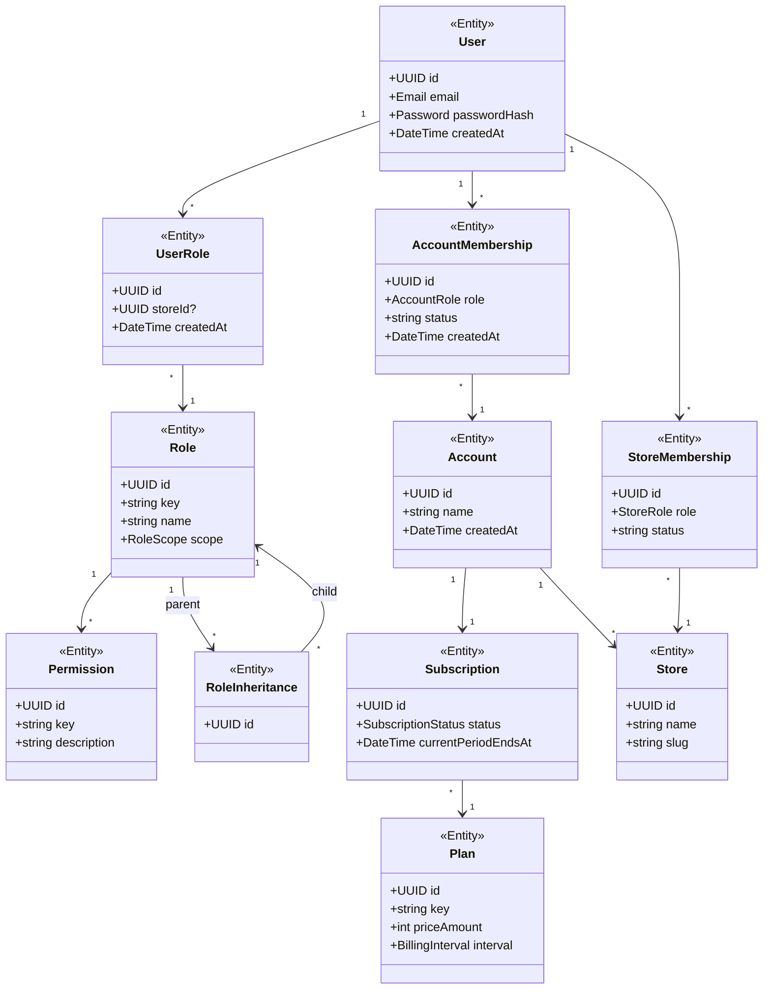

```mermaid
classDiagram

%% =========================
%% Core Identity
%% =========================

class User {
    <<Entity>>
    +UUID id
    +Email email
    +Password passwordHash
    +DateTime createdAt
}

class Role {
    <<Entity>>
    +UUID id
    +string key
    +string name
    +RoleScope scope
}

class Permission {
    <<Entity>>
    +UUID id
    +string key
    +string description
}

class RoleInheritance {
    <<Entity>>
    +UUID id
}

class UserRole {
    <<Entity>>
    +UUID id
    +UUID storeId?
    +DateTime createdAt
}

%% =========================
%% Account Layer
%% =========================

class Account {
    <<Entity>>
    +UUID id
    +string name
    +DateTime createdAt
}

class AccountMembership {
    <<Entity>>
    +UUID id
    +AccountRole role
    +string status
    +DateTime createdAt
}

class Subscription {
    <<Entity>>
    +UUID id
    +SubscriptionStatus status
    +DateTime currentPeriodEndsAt
}

class Plan {
    <<Entity>>
    +UUID id
    +string key
    +int priceAmount
    +BillingInterval interval
}

%% =========================
%% Store Layer
%% =========================

class Store {
    <<Entity>>
    +UUID id
    +string name
    +string slug
}

class StoreMembership {
    <<Entity>>
    +UUID id
    +StoreRole role
    +string status
}

%% =========================
%% Relationships
%% =========================

User "1" --> "*" UserRole
UserRole "*" --> "1" Role

Role "1" --> "*" Permission
Role "1" --> "*" RoleInheritance : parent
RoleInheritance "*" --> "1" Role : child

User "1" --> "*" AccountMembership
AccountMembership "*" --> "1" Account

Account "1" --> "*" Store
Account "1" --> "1" Subscription

Subscription "*" --> "1" Plan

User "1" --> "*" StoreMembership
StoreMembership "*" --> "1" Store
```