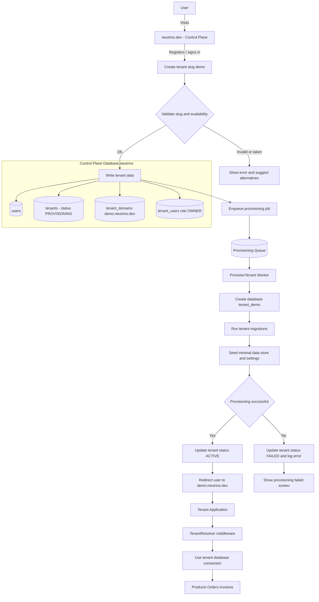

```mermaid
flowchart TD
%% Neutrino SaaS: DB-per-tenant provisioning flow

    U[User] -->|Visits| A[neutrino.dev - Control Plane]
    A -->|Registers / signs in| B[Create tenant slug demo]

    B --> C{Validate slug and availability}
    C -->|Invalid or taken| C1[Show error and suggest alternatives]
    C -->|OK| D[Write tenant data]

    subgraph CPDB[Control Plane Database neutrino]
        D --> D1[(users)]
        D --> D2[(tenants - status PROVISIONING)]
        D --> D3[(tenant_domains demo.neutrino.dev)]
        D --> D4[(tenant_users role OWNER)]
    end

    D --> E[Enqueue provisioning job]
    E --> Q[(Provisioning Queue)]

    Q --> F[ProvisionTenant Worker]
    F --> G[Create database tenant_demo]
    G --> H[Run tenant migrations]
    H --> I[Seed minimal data store and settings]
    I --> J{Provisioning successful}

    J -->|Yes| K[Update tenant status ACTIVE]
    J -->|No| L[Update tenant status FAILED and log error]

    K --> M[Redirect user to demo.neutrino.dev]
    M --> N[Tenant Application]
    N --> O[TenantResolver middleware]
    O --> P[Use tenant database connection]
    P --> R[Products Orders Invoices]

    L --> S[Show provisioning failed screen]
```