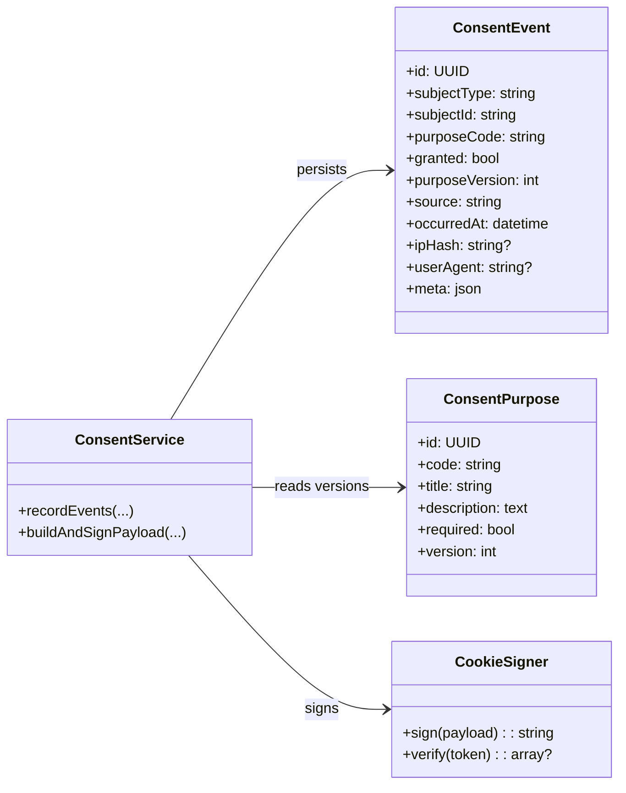

```mermaid
classDiagram
direction LR

class ConsentPurpose {
  +id: UUID
  +code: string
  +title: string
  +description: text
  +required: bool
  +version: int
}

class ConsentEvent {
  +id: UUID
  +subjectType: string
  +subjectId: string
  +purposeCode: string
  +granted: bool
  +purposeVersion: int
  +source: string
  +occurredAt: datetime
  +ipHash: string?
  +userAgent: string?
  +meta: json
}

class ConsentService {
  +recordEvents(...)
  +buildAndSignPayload(...)
}

class CookieSigner {
  +sign(payload): string
  +verify(token): array?
}

ConsentService --> ConsentEvent : persists
ConsentService --> ConsentPurpose : reads versions
ConsentService --> CookieSigner : signs
```